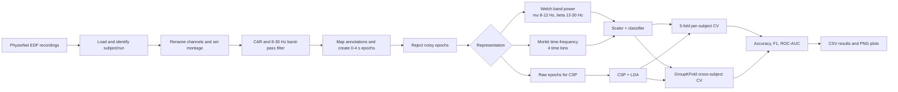
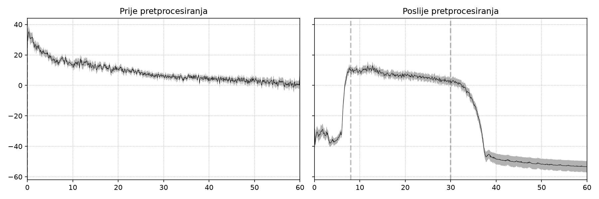
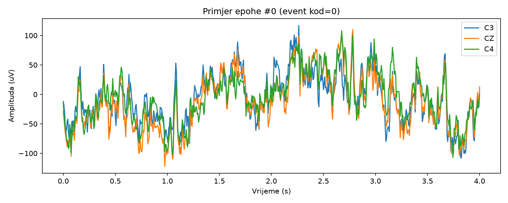
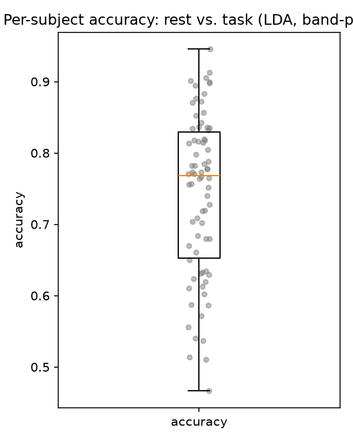

# EEG Motor Movement and Imagery Classification

This repository contains an end-to-end EEG processing and machine-learning pipeline for the PhysioNet **EEG Motor Movement/Imagery Dataset**. It loads EDF recordings, standardizes and preprocesses the signals, creates task epochs, extracts frequency and time-frequency features, trains several classifiers, and evaluates both within-subject and cross-subject performance.

The project is intended for a reproducible research workflow rather than a real-time BCI application. The saved CSV files and PNG figures in this repository are example outputs from the implemented pipeline.

## Pipeline



## What is implemented

- **Data loading:** reads PhysioNet EDF+ recordings and organizes them by subject and run.
- **Run interpretation:** identifies baseline, unilateral, and bilateral runs, and distinguishes execution from imagery.
- **Preprocessing:** channel-name cleanup, standard 10-10/10-20 montage, common average reference, optional notch filtering, 8-30 Hz band-pass filtering, optional ICA, and amplitude-based epoch rejection.
- **Epoching:** creates 4-second epochs from task annotations using consistent event codes across runs and subjects.
- **Feature extraction:**
  - Welch power in the mu (8-12 Hz) and beta (13-30 Hz) bands.
  - Morlet wavelet power with four temporal bins per epoch.
  - Raw epochs for CSP.
- **Models:** LDA, linear SVM, RBF SVM, Random Forest, Histogram Gradient Boosting, and CSP + LDA.
- **Evaluation:** stratified 5-fold cross-validation within subjects and group-aware cross-validation across subjects.
- **Outputs:** cached features, experiment grids in CSV format, confusion matrices, PSD comparisons, and per-subject accuracy plots.

## Dataset and run structure

The code follows the run protocol used by the PhysioNet dataset:

| Run type | Run IDs | Meaning |
| --- | --- | --- |
| Baseline, eyes open | 1 | Continuous baseline |
| Baseline, eyes closed | 2 | Continuous baseline |
| Unilateral | 3, 4, 7, 8, 11, 12 | Left/right fist events |
| Bilateral | 5, 6, 9, 10, 13, 14 | Both fists/both feet events |

The code maps the original annotations as follows:

| Run family | Rest | Class 1 | Class 2 |
| --- | --- | --- | --- |
| Unilateral | `T0 -> rest` | `T1 -> left_fist` | `T2 -> right_fist` |
| Bilateral | `T0 -> rest` | `T1 -> both_fists` | `T2 -> both_feet` |

The local `files/` directory is ignored by Git. Download the dataset from [PhysioNet](https://physionet.org/content/eegmmidb/1.0.0/) and place the EDF files under `src/files/` using the dataset's subject directories, for example `src/files/S001/S001R01.edf`.

## Classification tasks

The available binary tasks are defined in `src/značajke.py`:

| Task | Label 0 | Label 1 |
| --- | --- | --- |
| `left_right_fist` | Left fist | Right fist |
| `fists_feet` | Both fists | Both feet |
| `execution_vs_imagery` | Real execution | Imagined execution |
| `rest_vs_task` | Rest | Any motor task |

## Project layout

```text
.
├── README.md
├── DOCUMENTATION.md
└── src/
    ├── obrada.py                         # Loading, annotation mapping, epoching
    ├── pretprocesiranje.py               # Preprocessing and diagnostic plots
    ├── značajke.py                       # Tasks and feature extraction
    ├── modeli.py                          # ML pipelines and CV helpers
    ├── evaluacija.py                     # Evaluation grid and result export
    ├── dedupe.py                         # Utility for duplicate data handling
    ├── example_epoch.png                 # Example epoch plot
    ├── psd_comparison.png                # PSD before/after preprocessing
    └── results/
        ├── experiment_grid_per_subject.csv
        ├── experiment_grid_cross_subject.csv
        └── boxplot_rest_vs_task_lda.png
```


## Installation

Use Python 3.10 or newer and install the scientific Python dependencies:

```powershell
python -m venv .venv
.\.venv\Scripts\Activate.ps1
python -m pip install --upgrade pip
python -m pip install mne numpy scipy pandas matplotlib scikit-learn
```

The repository also contains a local virtual environment in some working copies. It is ignored from version control and is not required; creating a fresh environment is recommended.

## Running the pipeline

Run commands from the repository root. Because the modules use local imports and relative data paths, execute scripts from `src/`:

```powershell
Set-Location .\src
python .\obrada.py
```

The loader example applies common average reference, an 8-30 Hz band-pass filter, and 150 microvolt peak-to-peak epoch rejection. It verifies subject `S001` and can save processed FIF files when `save_subject_epochs(subjects)` is enabled in the script.

To generate preprocessing diagnostic figures:

```powershell
Set-Location .\src
python .\pretprocesiranje.py
```

To run the example model evaluation and the configured experiment grid:

```powershell
Set-Location .\src
python .\evaluacija.py
```

Results are written to `src/results/`. Feature computations are cached in `src/cache/` so interrupted grid experiments can resume without recomputing completed combinations.

## Evaluation methodology

Two evaluation scenarios are provided:

1. **Per-subject:** a stratified 5-fold split is performed independently for each subject. This measures how well a model can work after subject-specific data are available.
2. **Cross-subject:** subjects are kept intact as groups using `GroupKFold` or leave-one-subject-out evaluation. A subject must never appear in both training and test data. This is the more realistic estimate of generalization to unseen people.

All learned transformations, including scaling, PCA, and CSP, are placed inside scikit-learn pipelines so they are fitted within each training fold. Feature caches are keyed by task, representation, channel selection, modality, subject IDs, and the minimum epoch threshold.

The default grid excludes subjects with fewer than 30 usable epochs and removes individual epochs containing non-finite feature values. These are methodological choices and should be reported alongside any newly generated results.

## Recorded results

The tables below summarize the strongest rows by accuracy from the CSV files currently committed to `src/results/`. Values are means across the evaluation units reported in the `n` column; they are not claims about every possible task or configuration.

### Per-subject results

| Task | Representation | Channels | Classifier | Accuracy | F1 | ROC-AUC | n |
| --- | --- | --- | --- | ---: | ---: | ---: | ---: |
| `rest_vs_task` | Band power | All | Linear SVM | 0.793 | 0.800 | 0.857 | 74 |
| `left_right_fist` | Raw + CSP | Motor | CSP + LDA | 0.669 | 0.651 | 0.717 | 57 |
| `left_right_fist` | Time-frequency | All | Linear SVM | 0.659 | 0.647 | 0.704 | 57 |

### Cross-subject results

| Task | Representation | Channels | Classifier | Accuracy | F1 | ROC-AUC | n |
| --- | --- | --- | --- | ---: | ---: | ---: | ---: |
| `rest_vs_task` | Time-frequency | All | Random Forest | 0.647 | 0.663 | 0.708 | 10 |
| `left_right_fist` | Time-frequency | All | Linear SVM | 0.642 | 0.612 | 0.689 | 10 |
| `left_right_fist` | Time-frequency | All | Random Forest | 0.637 | 0.630 | 0.698 | 10 |

The difference between per-subject and cross-subject performance is expected: EEG signals vary substantially between people, and cross-subject evaluation prevents the model from relying on subject-specific patterns.

## Figures

### PSD before and after preprocessing

The figure compares the power spectral density of a recording before and after the configured preprocessing steps.



### Example epoch

This figure shows the time course of selected EEG channels from one 4-second epoch.



### Per-subject accuracy distribution

The boxplot shows the distribution of per-subject accuracy for the `rest_vs_task` task using LDA and band-power features.



## Reproducibility notes

- The default random seed is `42`.
- The sampling rate specified by the dataset is 160 Hz.
- Epochs span 0 to 4 seconds after each task event.
- Normalization statistics must be estimated from training data only; fitting them on the complete dataset would leak information from the test folds.
- CSP is fitted inside the cross-validation pipeline for the same reason.
- The CSV files preserve the exact aggregate outputs generated by the current implementation. Re-running experiments after changing dependencies, preprocessing settings, or the input data may produce different values.

## Limitations and next steps

- The current repository does not include automated unit tests or a pinned dependency lockfile.
- ICA is fitted and returned for inspection, but automatic component selection is not enabled because the dataset does not provide dedicated EOG channels.
- The available result grid covers `left_right_fist` and `rest_vs_task`; the other task definitions are implemented but are not represented in the committed grid tables.
- Future work could add nested hyperparameter tuning, confidence intervals, explicit subject metadata, and a fully automated figure/report generation command.

## License and data use

This repository contains research code. Consult the [PhysioNet dataset page](https://physionet.org/content/eegmmidb/1.0.0/) for the dataset's citation, license, and data-use conditions. Cite the original dataset and the relevant methods when reusing the data or results.
